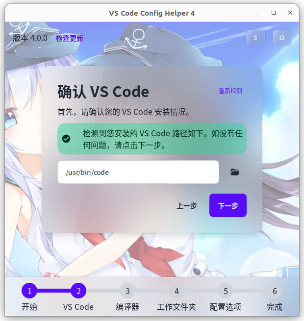
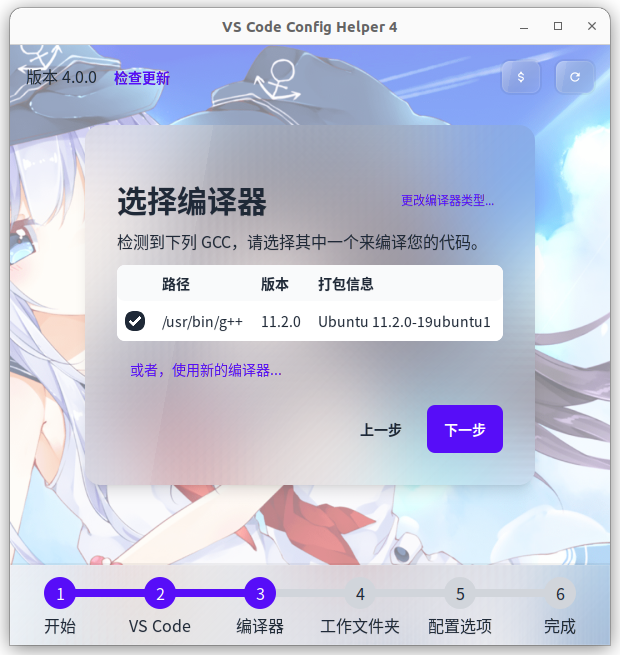
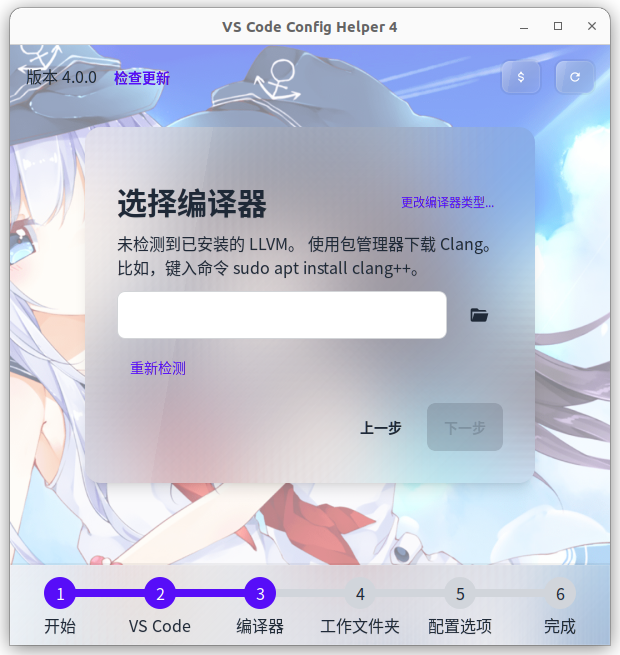
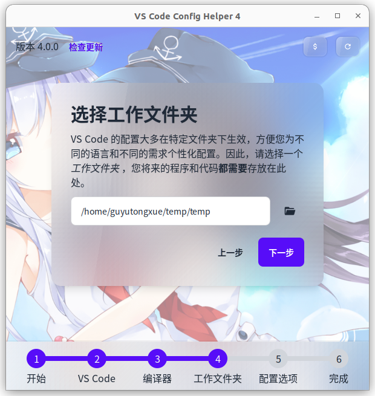
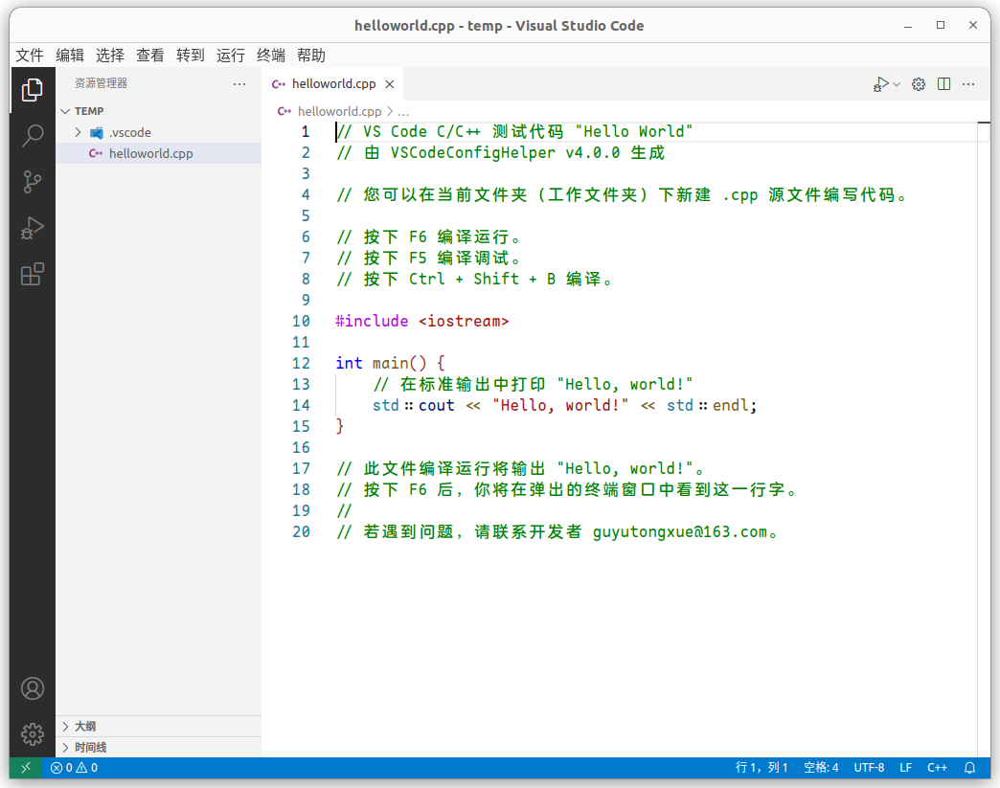

# Linux 配置说明

## 重要说明

- 本软件仅适用于 x64 架构。
- 本软件只在 Ubuntu 下测试过。不保证本软件在其它发行版上是否可用。
- 如果你使用 WSL，建议你参考 CLI 配置说明。如果你倾向于使用图形界面，请：
  1. 确保你的 WSL 启用了 WSLg；
  2. 确保安装了中文字体。

> WSL/Ubuntu 下中文字体安装方法：
> 1. 修改 `/etc/locale.gen`，使得 `zh_CN.UTF-8 UTF-8` 行可用。
> 2. 执行以下命令：  
>   ```sh
>   sudo locale-gen
>   sudo apt install fonts-wqy-microhei ttf-wqy-zenhei > language-pack-zh-hans language-pack-gnome-zh-hans > language-pack-kde-zh-hans manpages-zh
>   ```
> 3. 在 Windows 中重启 WSL 实例：  
>   ```powershell
>   wsl --shutdown
>   ```

## 第一步：下载 VS Code

前往[官方网站](https://code.visualstudio.com/)获取 Linux 版 VS Code 并安装。

## 第二步：获取本软件

直接在[网站首页](https://vscch.guyutongxue.site/)下载即可。Linux 版共有两种下载：
1. （默认）AppImage。体积较大，但保证可以在各大发行版运行。
2. 可执行文件。体积较小，但可能需要外部链接库才能正常运行。

下载完成后，请赋予其可执行权限。
```sh
chmod +x ./vscch_blah_blah_blah.AppImage
```

## 第三步：开始配置

双击运行，或在终端启动本程序。你将看到如下界面：


> 如果你无法正常启动，可以先尝试更新系统依赖（如 `apt update` 和 `apt upgrade`
）。如问题仍存在，则可改用 CLI。

点击“下一步”以继续。

### VS Code 选择



如果你已经正确安装了 VS Code，则此处将显示你的 VS Code 安装路径，点击“下一步”即可。如果你不能点击下一步，则表明工具没有检测到已安装的 VS Code。这可能是由于你没有将 VS Code 所在路径添加到 `PATH` 环境变量导致的（比如从源码构建）。你可以在这里手动输入其路径，或者重新从官网安装。

### 编译器选择



如果你已经安装了 GCC 编译器，则这里将显示它的路径和版本信息，点击“下一步”即可。如果你希望使用 LLVM/Clang，你可以点击右上角的“更改编译器类型”，并选择“LLVM”。

如果你还没有安装 GCC 或者 LLVM，建议你使用该 Linux 发行版的包管理工具获取它们（比如 `sudo apt install g++`）。安装好后，重新运行本工具（保证 `PATH` 环境变量可被正确读取）以使用它们。



此外，如果你想使用从源码编译的、尚未安装的编译器；或者其它的编译器版本（如 `g++-9`），你可以将该编译器的路径输入到文本框中。（点击表格下方的“或者，使用新的编译器”按钮即可跳转到文本框界面。）


### 工作文件夹选择



输入任意的工作文件夹路径，你的代码以后应当存放在该文件夹内。若该文件夹尚未创建，则工具会自动创建它。点击“下一步”以继续。

### 调整配置选项

一般保持默认即可，具体可参考[配置选项说明](./options.md)。点击“下一步”后，耐心等待工具完成配置流程。

## 第四步：测试

如果配置选项中勾选了“配置完成后自动启动 VS Code”，且未禁用“生成测试文件”，则工具将自动为你打开工作文件夹，并显示工具生成的测试代码。

如果你第一次使用 LLVM/Clang 编译器，CodeLLDB 扩展会启动并下载必要组件。请耐心等待其完成。如无法下载，可尝试切换网络环境。



在该页面按下运行快捷键（默认为 <kbd>F6</kbd>），即可编译并运行该代码。


> 此时优先弹出注册在 X 窗口系统中的终端模拟器（`x-terminal-emulator`）。在 WSL 下，还会尝试使用宿主系统弹窗。如果运行失败，你可以将具体问题反馈到 [pause-console 仓库](https://github.com/VSCodeConfigHelper/pause-console/issues)。

在该页面按下调试快捷键（默认为 <kbd>F5</kbd>），即可调试该代码。调试前建议打断点。
